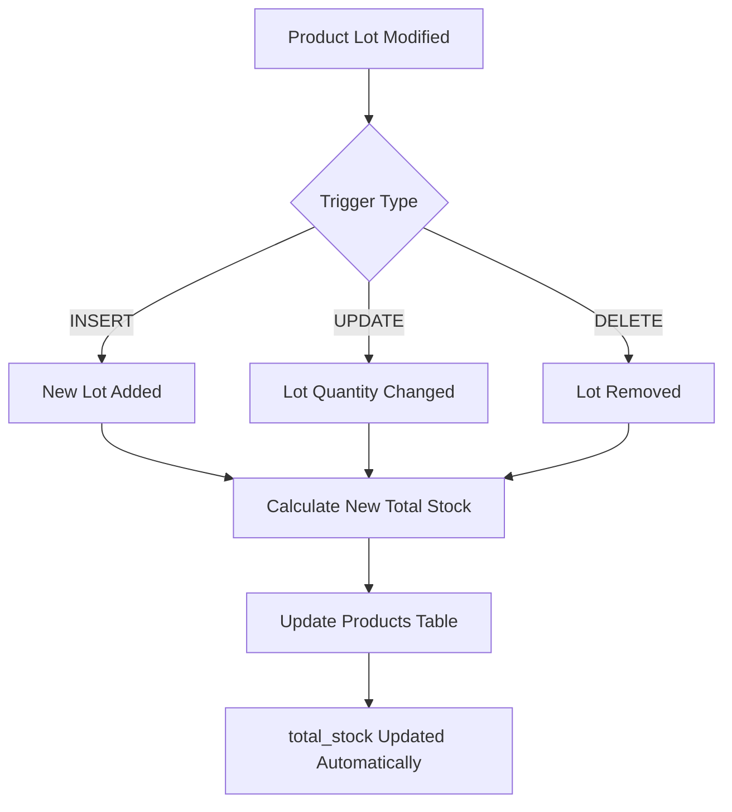

# 📊 Total Stock Automatic Calculation Solution

## 🎯 Problem Summary

The product table has a `total_stock` field that should automatically display the sum of all stock quantities from the `product_lot` table for each product. The existing implementation was missing:

1. The `total_stock` column in the database schema
2. Trigger functions to automatically calculate and update the total stock
3. Proper triggers that fire when product lots are modified

## ✅ Solution Overview

This solution implements a comprehensive automatic total stock calculation system that:

- ✅ Adds the missing `total_stock` column to the products table
- ✅ Creates trigger functions that automatically calculate total stock from product lots
- ✅ Sets up triggers that fire on INSERT, UPDATE, and DELETE operations on product_lots
- ✅ Initializes correct total_stock values for existing products
- ✅ Provides maintenance functions for recalculation
- ✅ Ensures data consistency and performance

## 🚀 Implementation Steps

### Step 1: Apply the Migration

Execute the migration file in your Supabase SQL Editor:

```sql
-- Run this in Supabase SQL Editor
\i database/migrations/007_total_stock_implementation.sql
```

Or copy and paste the contents of `007_total_stock_implementation.sql` directly into the SQL Editor.

### Step 2: Verify the Implementation

Run the test script to verify everything works correctly:

```sql
-- Run this in Supabase SQL Editor
\i database/test_total_stock_triggers.sql
```

### Step 3: Monitor and Maintain

Use the provided maintenance function when needed:

```sql
-- Recalculate all total stocks (if needed for maintenance)
SELECT recalculate_all_total_stocks();
```

## 🔧 Technical Details

### Database Changes

1. **New Column**: Added `total_stock DECIMAL(10,2)` to the products table
2. **New Index**: Added performance index on `total_stock` column
3. **New Functions**:
   - `calculate_product_total_stock(product_id)`: Calculates total stock for a specific product
   - `update_product_total_stock()`: Trigger function that updates total stock automatically
   - `recalculate_all_total_stocks()`: Maintenance function for bulk recalculation

### Triggers Created

1. **INSERT Trigger**: Updates total_stock when new lots are added
2. **UPDATE Trigger**: Updates total_stock when lot quantities are modified
3. **DELETE Trigger**: Updates total_stock when lots are removed

### How It Works



## 🧪 Testing Scenarios

The solution handles these scenarios automatically:

1. ✅ **Adding new lots for existing products**
2. ✅ **Modifying lot quantities (e.g., during sales)**
3. ✅ **Deleting expired or empty lots**
4. ✅ **FIFO sales processing** (existing trigger compatibility)
5. ✅ **Bulk operations and data imports**

## 📈 Performance Considerations

- **Indexed**: The `total_stock` column is indexed for fast queries
- **Efficient**: Triggers only update the specific affected product
- **Optimized**: Uses SUM aggregation with proper indexing on product_lots
- **Minimal Impact**: Triggers are lightweight and don't affect normal operations

## 🔍 Verification Queries

### Check Total Stock Accuracy
```sql
SELECT 
    p.id,
    p.name,
    p.total_stock,
    COALESCE(SUM(pl.quantity_remaining), 0) as calculated_total_stock,
    CASE 
        WHEN p.total_stock = COALESCE(SUM(pl.quantity_remaining), 0) THEN '✅ CORRECT'
        ELSE '❌ MISMATCH'
    END as status
FROM products p
LEFT JOIN product_lots pl ON p.id = pl.product_id
GROUP BY p.id, p.name, p.total_stock
ORDER BY p.id;
```

### Monitor Trigger Performance
```sql
-- Check if triggers are active
SELECT 
    trigger_name,
    event_manipulation,
    action_timing,
    action_statement
FROM information_schema.triggers 
WHERE trigger_name LIKE '%total_stock%';
```

## 🚨 Important Notes

1. **Backward Compatibility**: The solution maintains compatibility with existing code
2. **Data Integrity**: All existing data is preserved and correctly calculated
3. **Real-time Updates**: Changes are reflected immediately when lots are modified
4. **Error Handling**: Includes proper error handling and constraints
5. **Documentation**: All functions and columns are properly documented

## 🔧 Maintenance

### Regular Maintenance (Optional)
```sql
-- Run monthly to ensure data consistency
SELECT recalculate_all_total_stocks();
```

### Troubleshooting
If you notice any inconsistencies:

1. Run the recalculation function
2. Check the test script results
3. Verify triggers are active using the monitoring query above

## 📝 Integration with Existing Code

The solution is designed to work seamlessly with your existing:

- ✅ Product creation forms
- ✅ Inventory management
- ✅ Sales processing (FIFO)
- ✅ Stock transfer operations
- ✅ Reporting and analytics

No changes to application code are required - the `total_stock` field will now be automatically maintained by the database.
